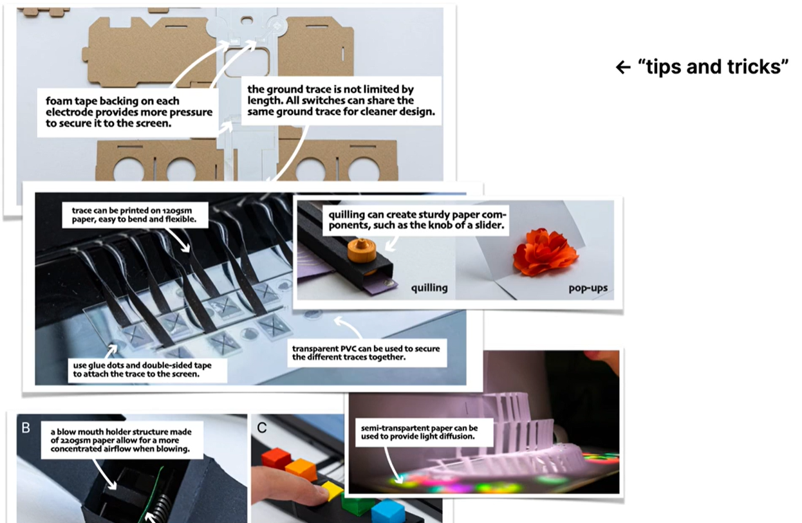

# Tactile User Interface (TUI)
A tactile user interface uses the sense of touch (haptics) to communicate information and allow interaction, moving beyond sight-based GUIs (Graphical User Interfaces) to provide physical feedback like clicks, vibrations, pressure, or textures, enabling richer interaction. 

**tactile interfaces** - stimulate the skin
**tangible interfaces** - incorporate physical objects as either output or input devices

## Characteristics:
[Source: Milani - UX / UI Trends](https://milani.ch/en/ueber-uns-en-us/blog/tactile-user-interface-vs-zero-user-interface-two-important-uxui-trends-that-all-product-designers-should-be-aware-of)

TUI is all about reintroducing the sense of touch into the digital realm. Using physical elements and tactile sensations together with digital products, such as buttons and switches, textured surfaces, feedback through vibrations and moving elements.

Engaging the senses for deeper emotional connection: Tactile interactions can evoke more engaging user experiences. Buttons that respond with a satisfying click, sliders that glide smoothly, and physical dials can create a deeper emotional connection.

Enhancing usability, inclusivity, and accessibility: Tactile cues and haptic feedback provide clear and intuitive directions. Users don't need to decipher abstract icons or gestures; they can simply interact with the physical world. TUI can thus make digital interfaces accessible to a wider audience and break down barriers for elderly users or users with visual impairments.

Providing a calmer and more intentional experience: Unconnected, tactile interfaces encourage focus and motivate users to concentrate on their present activity.

Blend analog and digital elements. Combine physical knobs, buttons, and dials with digital displays can provide users with the familiarity of traditional interfaces while harnessing the power of digital technology.

[Source: Nasa](https://ntrs.nasa.gov/api/citations/20050041780/downloads/20050041780.pdf)

Multipleresource theory stresses the importance of distribution of tasks and information across various human sensory channels to reduce mental workload. Unlike the more typical displays that
target vision or hearing, tactile displays present information to the user’s sense of touch.

By varying the position, amplitude, frequency, waveform type, and
duty cycle of the tactor, or by using multiple types of tactors, different qualities of stimulus can be provided. The challenge is to create an intuitive mapping of these stimuli to the information to be conveyed.

Tactile displays can be used in many situations. For desktop computing, tactile feedback may improve pointing at buttons, scrollbars, and menus, and may provide less distracting feedback than progress bars. It can assist with navigation, providing tactile cues about the location of a desired object or direction; or can be a substitute for sound cues, eliminating interference with important environmental sounds. It can also be used as a status display, utilizing tactile stimuli for out-of-range conditions.

**Passive touch:**

        stimulation presented passively to the skin of the hand or other body area

**Active touch:**

         utilizing distinct shapes or textures in the design of an object (button or lever). Improving recognition without sight.

When individuals had formed a mental model of where the items were located, certain locations on the boards appeared quicker to find. The slowest mean time
was when shape and size coding were used. 

Cutaneous perception = sensations of vibration, temperature, pain, and indentation. 

Passive cutaneous touch - sensitivity to stimulation varies greatly with the part of the body stimulated. 
The two-point discrimination threshold (ability to distinguish a stimulus composed of two separated pressure points from a single pressure stimulus) is lowest in the face and hand. 

> Pattern recognition or discrimination - finger

> Long-duration patterns change - thigh is a good candidate for a display site.

Tactile stimulators have a number of properties that can be used as vocabulary in the design of a tactile language: frequency, amplitude, waveform, duration, rhythm, body location, and spatiotemporal patterns.

## Paper Touch Switches:

