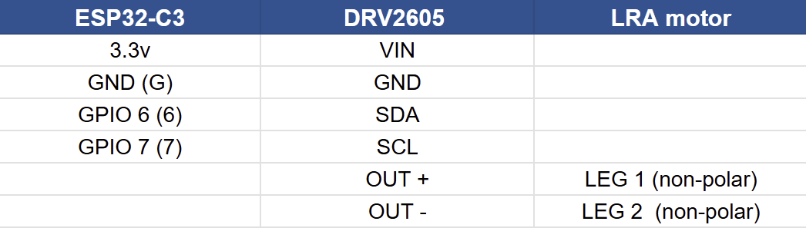
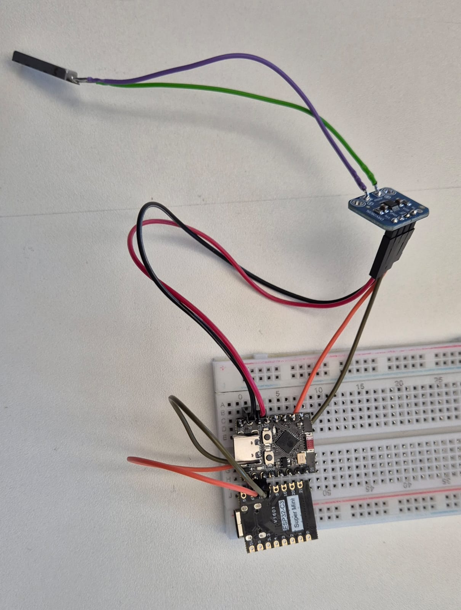
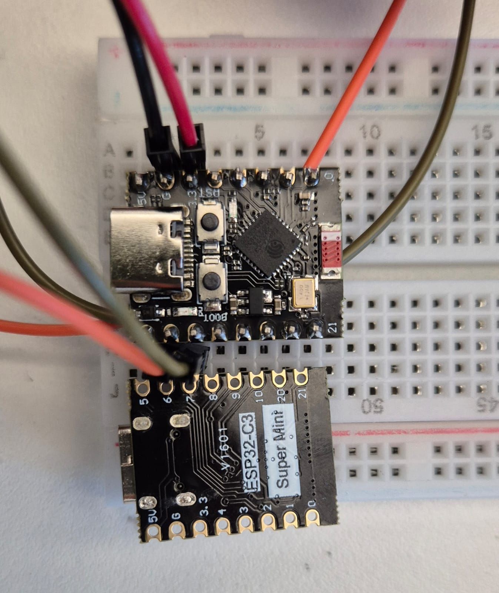
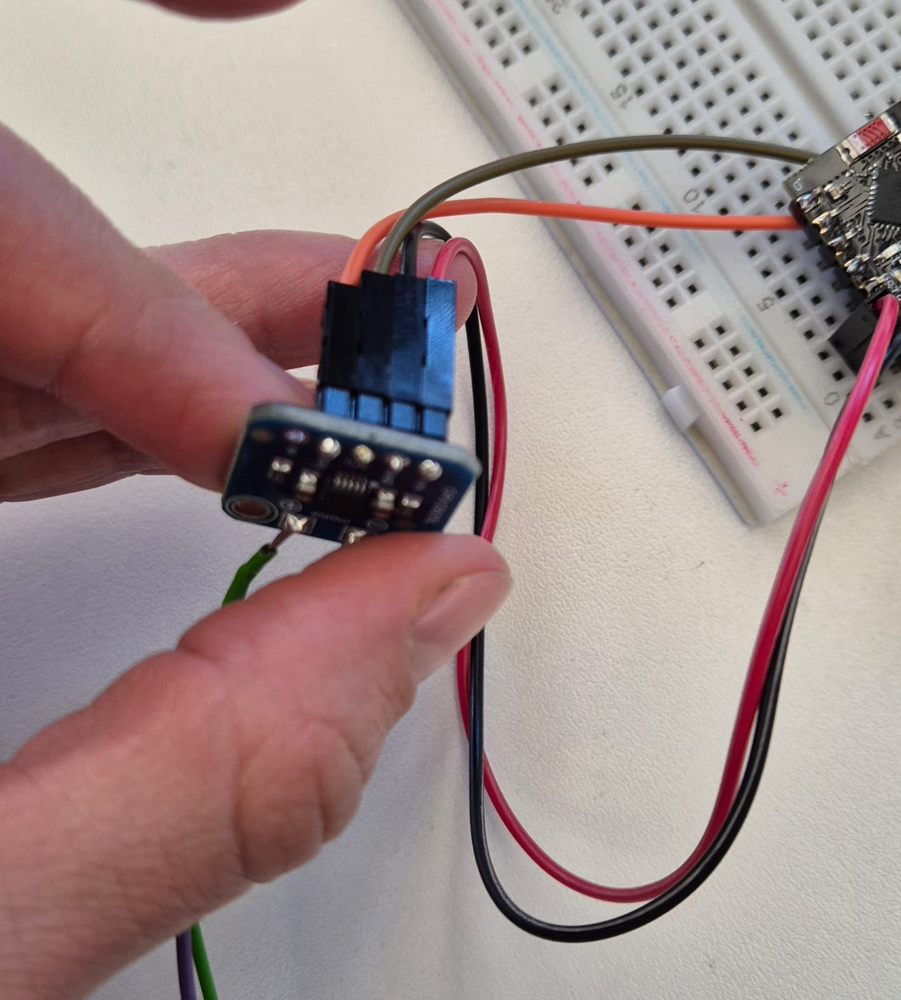
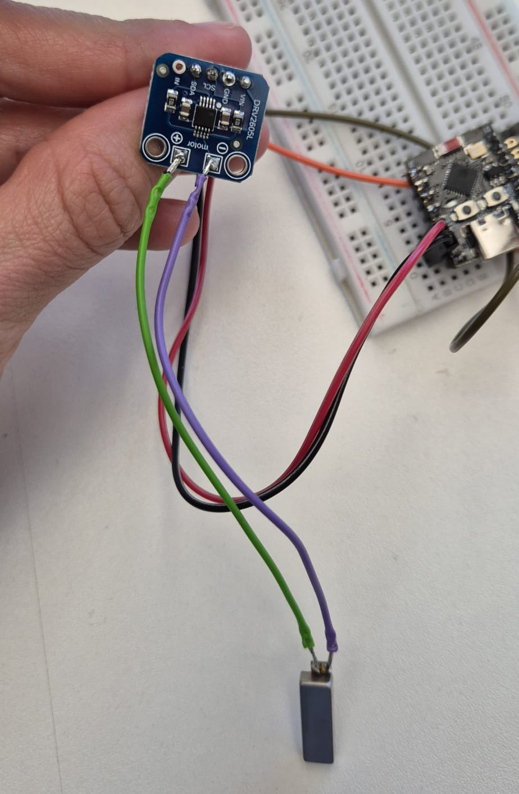
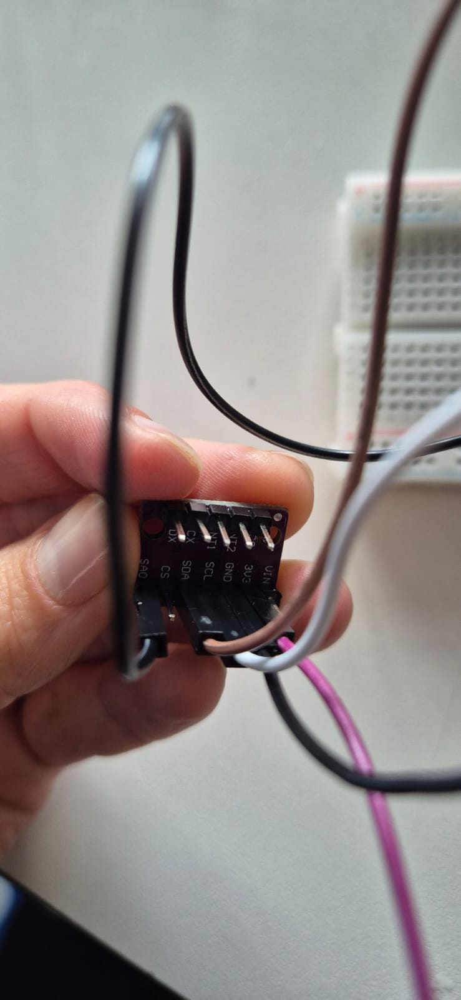
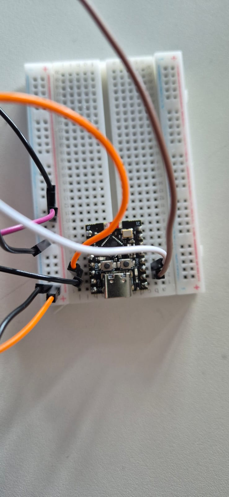
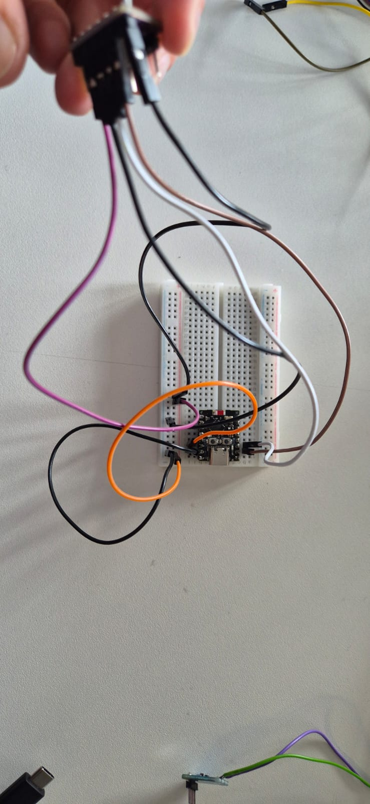

# Test to see if components are working

## ESP32-C3 Super Mini:

### Test1: board is alive
Set the following parameters for the board at Arduino IDE:
    
    - Go to Tools → Board → esp32 (Select ESP32C3 Dev Module)

Configure USB & Flash Settings (CRITICAL STEP) - Go to the Tools menu and set these specific options:
    

To run the test:
1. Hold the Boot button down (keep it down until step 4)
2. Connect the ESP32-C3 via USB
3. Upload the following code:

[Test if ESP32C3 is working code](Codes/Test_ESP32C3_ALIVE.ino)

4. When compiling is over (message: "Hard resetting via RTS pin..."), let go of the Boot button.
5. Press the RST button once

---------

### Test2: I2C Scanner
1. Copy the following code to IDE:

[I2C Scanner code](Codes/I2C_Scanner.ino)

2. Disconnect everything from the ESP32.
3. Connect Grounds (ESP32, Driver, External 5V Source).
4. Connect SDA/SCL (GPIO 6/7).
5. Connect VIN (from External 5V).
6. Upload the I2C Scanner. Confirm you see 0x5A.
7. Upload the Test Code.

---------

### Test 3: ESP32 + DRV2605 Driver + LRA motor
This is the general wiring to connect the ESP32-C3 with the DRV2605 haptic motor Driver and the LRA motor

Copy the following code to IDE to test the connection between the 3 components. This is the general code that plays the whole library of haptic effects contained in the DRV2605 haptic Driver:

[Play LRA basic library code](Codes/basic_LRA_Driver_ESP32.ino)

---------

### Test 4: Gyroscope (BMI160)
General wiring to connect the ESP32-C3 with the BMI160.

Code to test the gyroscope with the ESP32-C3:

[Test if Gyro is ALIVE](Codes/Test_Gyro_ALIVE.ino)