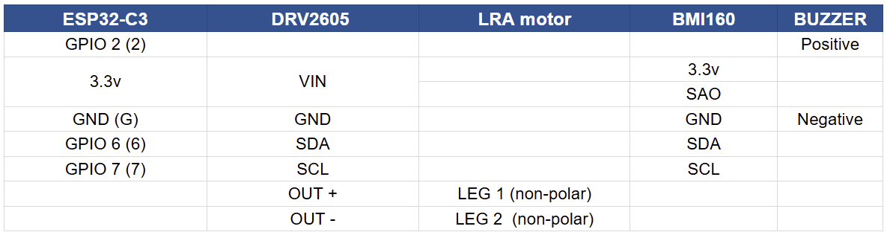
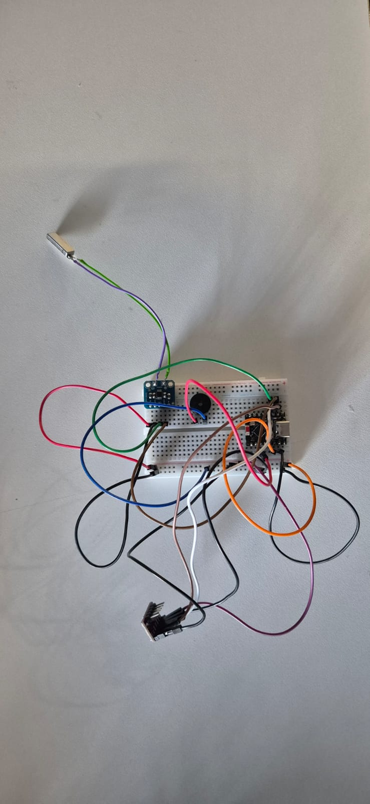
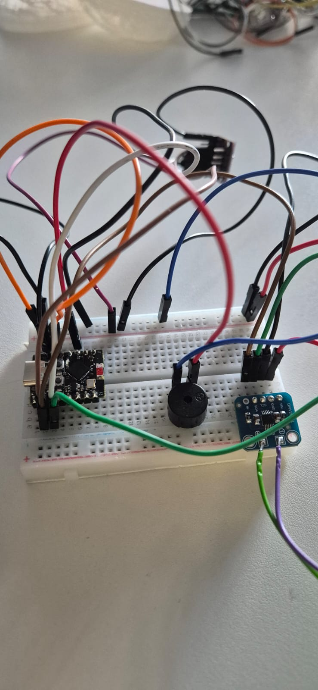
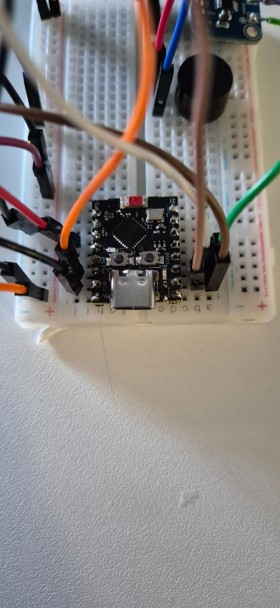

# Hollow circuit
The Hollows are the physical fragments of the Creature, that combine and divide themselves in order to alter the creature inner being.

## Wiring
The Hollows are composed of 6 components:
- Microcontroler (ESP32-C3)
- Gyroscope (BMI 160)
- Motor Haptic driver (DRV2605)
- LRA - Linear Resonant Actuator (0619AAC 1.2V 100mA)
- Speaker Amplifier (MAX98357A)
- Bone Conduction Speakers (13mm 8ohm)

