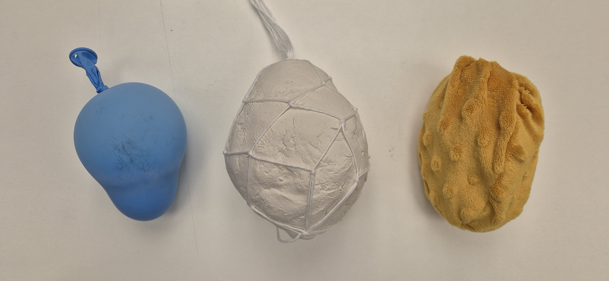

# Material Research

Material study and prototypes regarding the physical modules to be used as haptic (Tactile, Sound and Visual) controlers.

## Materiality
The first material test was to elaborate a series of 3 hand-size objects with different materials (rubber, clay, fabric) that people could manipulate. 
The objects were laid on a table and let there with no futher explanation or invite to engage, in order to understand if people would spontaneously approach and touch them and how they will be held and played with.

People were naturaly drawn to the 3 objects and all participants choose to engage with the rubber first.
Their first reaction was to cup it with their hands and, realizing the sound their movement produced, to shake it or move their arms with it.

<video controls src="IMG_ref/Materials.mp4" title="Title"></video>

## Hollow
First experiences to define the shape and size of the Hollows (haptic modules)

### 3D printing TPU
Although none of the 3D printing worked, it helped better understand the scale of the piece and also that the TPU, although flexible, could not reproduce the tactile properties desired for the project, being a bit too stiff and not that inviting to the touch.

