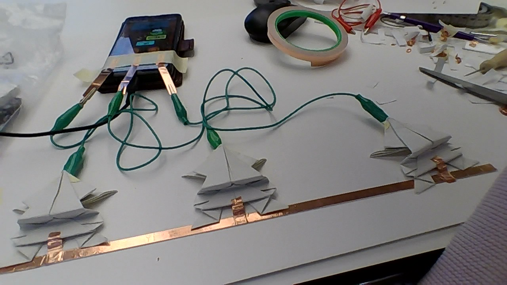

# Tactile buttons

How can we play with buttons formats, textures, movements to make it clear what they activate even without a screen.

## Frog button
This first test used conductive tape to map a smartphone touchscreen and extend it sensibility to paper origami.
A frog jumping game was choosen to test the buttons and three sheets of paper were shaped in the format of frogs and layed one beside the other to represent the positions to which the game frog could move.
The idea was that the player could be able to play the game making the physical paper frogs jump and receive only hearing feedback from the game to know if its jumps were successful or not.

### Materials:
- touchscreen with mini game
- 4 Alligator Clip Jumpers
- conductive tape
- 3 origami jumping frogs
- usb-c cable (connect smartphone ground to frogs ground)

.jpeg>)
.jpeg>)

<video controls src="IMGs/WhatsApp Video 2025-12-16 at 10.32.19.mp4" title="Title"></video>
<video controls src="IMGs/WhatsApp Video 2025-12-16 at 10.32.20.mp4" title="Title"></video>

### Questions/Intentions:
- Understand if giving the buttons a physical format with physical movement take attention to physical, tactile play.
- Do the paper frogs are intuitive and make people want to touch them?
- Do the connection between a digital and physical twins augments the opportunities of interaction, making technology occupy a place similar to "magic", giving life to objects. 
- It doesn't take people away from reality or hide it - by taking digital graphics out of the equation, it plays with senses and creativity, augmenting objects and spaces 

### Issues/Learnings:
- Conductive tape connection is very instable and break easly when manipulated (frog jumping)
- Smartscreens can only take one input at a time. If more inputs are recognized at the same time, the screen freezes
- Physical moving buttons tend to move away and wires block them or take the movement away (maybe it needs to be bluetooth controlled?) 