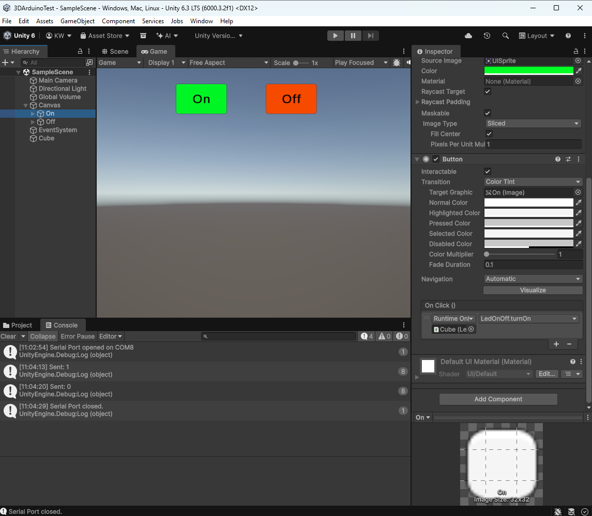
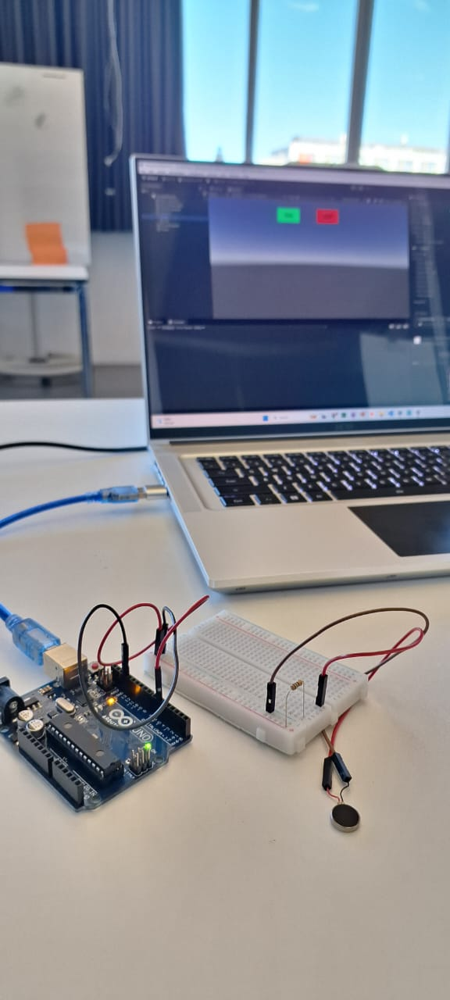

# Arduino + Unity

Connecting arduino to unity in order to use tactile inputs to guide the player in a game.
The idea is to test arduino components individually to understand the reactions and what kind of information is perceived by users to each stimulus.

## Led on/off
This first test was to make a led turn on and off being controlled by unity buttons. The main difficulty was to make the same port connect with arduino and Unity at the same time and exchange information through it.

Working test:
1. Arduino IDE open with serial monitor closed
2. Arduino connected to port COM8
3. Unity play in Game mode (linking script arduino+Unity applied to cube. Button with logic on click() logic with cube applied and script public void 'turnOn'/'turnOff called to each button)

- LedOn Unity C#: [code](REFs/LedOnOff2.cs)
- LedOn arduino IDE: [code](REFs/UnityLed.ino)

## Vibration Motor on/off
The second test was to make a mini vibration motor 2mm to turn on and off being controlled by the same unity buttons, to understand if the same logic of the led can be easly replicated for other components. The motor was simply wired with a 150ohm resistor and worked easly with a few adaptations to the arduino and unity script.

- Vibration motor Unity c#: [code](REFs/VibrationMotor.cs)
- Vibration motor arduino IDE: [code](REFs/VibrationMotor.ino)

## Spatial Lights location
The objective of this third prototype is to test the spatial logic communication for future devellopment on the final project.
A virtual NPC walk around a virtual space. The NPC general location is displayed physically by the activation of 8 different lights, which work as a compass, displaying the general direction of the NPC based on a fixed central origin (players location).