# Tactile buttons

How can we play with buttons formats, textures, movements to make it clear what they activate even without a screen.

## Frog button
This first test used conductive tape to map a smartphone touchscreen and extend it sensibility to paper origami.
A frog jumping game was choosen to test the buttons and three sheets of paper were shaped in the format of frogs and layed one beside the other to represent the positions to which the game frog could move.
The idea was that the player could be able to play the game making the physical paper frogs jump and receive only hearing feedback from the game to know if its jumps were successful or not.

### Materials:
- touchscreen with mini game
- 4 Alligator Clip Jumpers
- conductive tape
- 3 origami jumping frogs
- usb-c cable (connect smartphone ground to frogs ground)

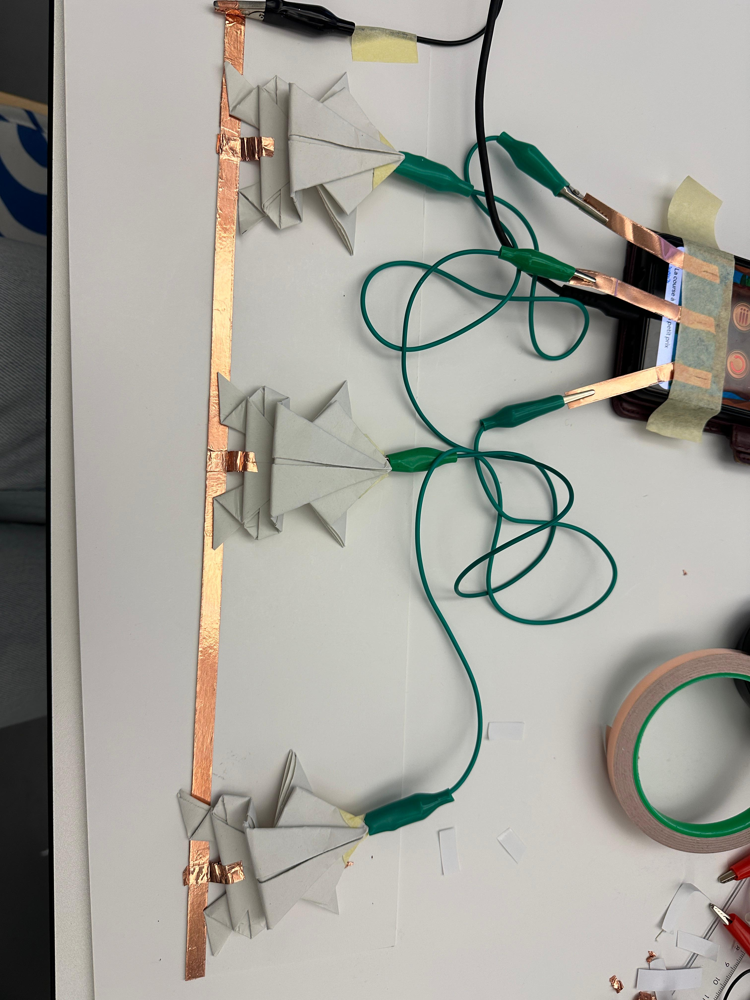
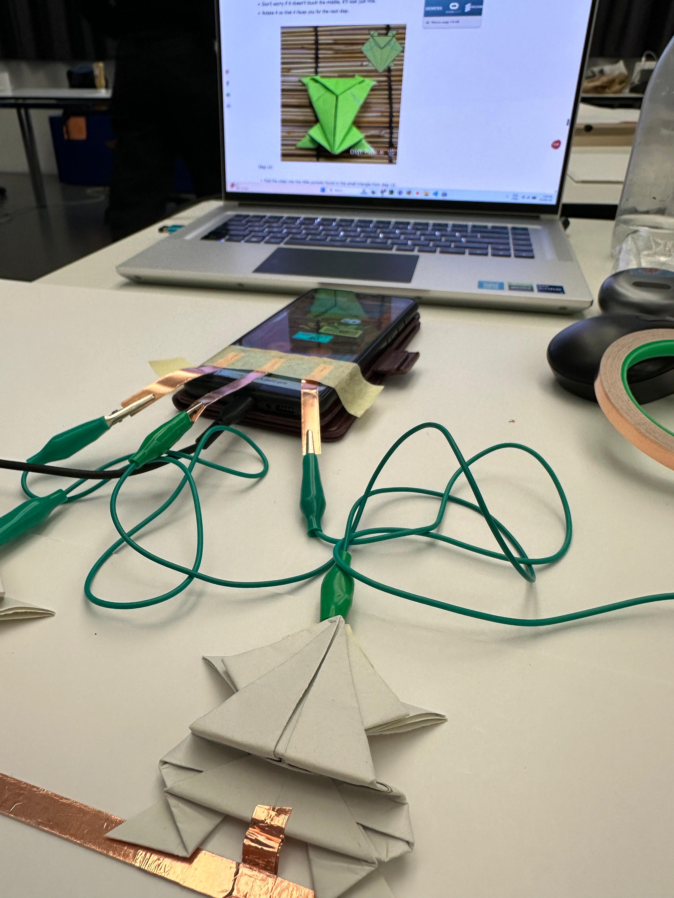
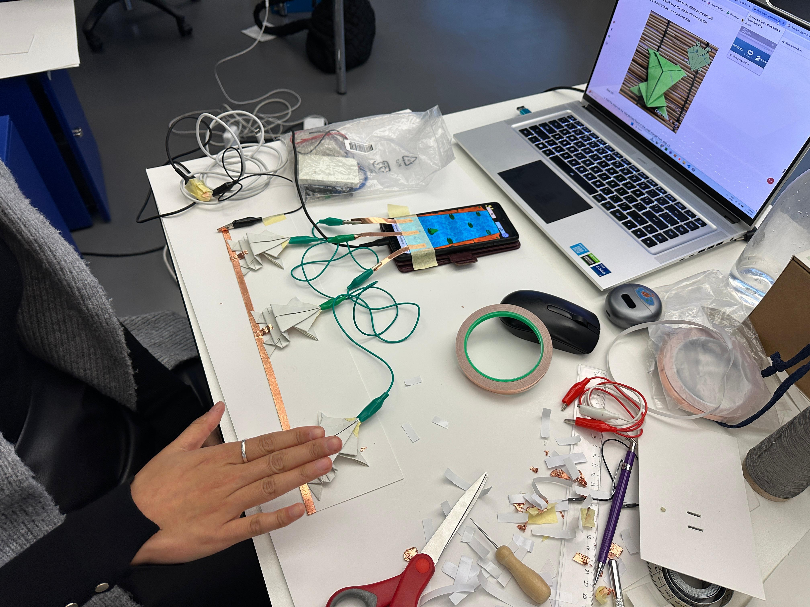
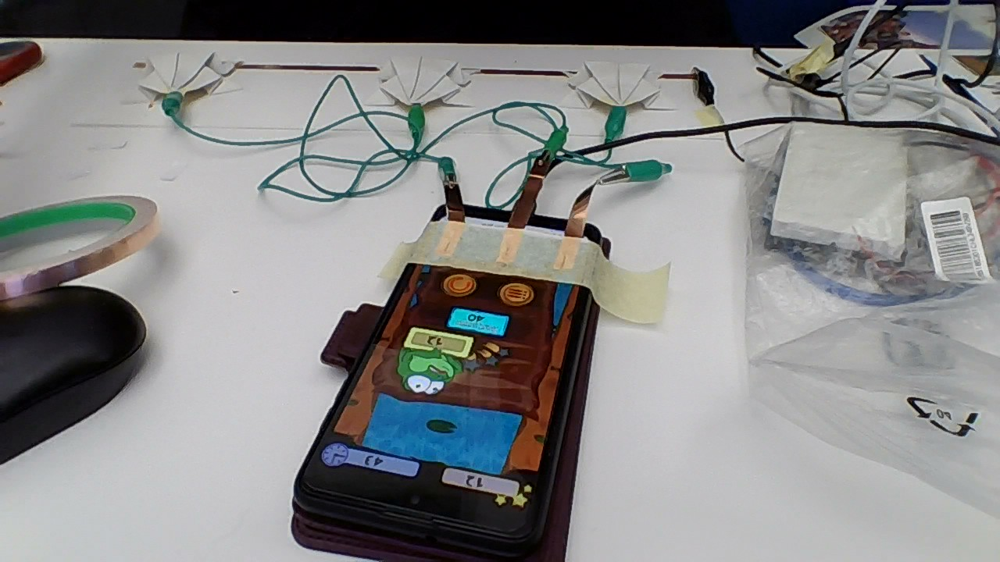

<video controls src="IMG_ref/Frog1.4.mp4" title="Title"></video>
<video controls src="IMG_ref/Frog1.5.mp4" title="Title"></video>

### Questions/Intentions:
- Understand if giving the buttons a physical format with physical movement take attention to physical, tactile play.
- Do the paper frogs are intuitive and make people want to touch them?
- Do the connection between a digital and physical twins augments the opportunities of interaction, making technology occupy a place similar to "magic", giving life to objects. 
- It doesn't take people away from reality or hide it - by taking digital graphics out of the equation, it plays with senses and creativity, augmenting objects and spaces 

### Issues/Learnings:
- Conductive tape connection is very instable and break easly when manipulated (frog jumping)
- Smartscreens can only take one input at a time. If more inputs are recognized at the same time, the screen freezes
- Physical moving buttons tend to move away and wires block them or take the movement away (maybe it needs to be bluetooth controlled?) 

## Version II

Instead using only conductive tape, the frogs buttons were connected by soldered wires with large metal clips on the points.
Conductive tape was used only to connect the cables to the smartphone screen.
The circuit worked much better and had a good stability, but again the conductive tape conductivity would wear out after a couple of hours or if moved too much.

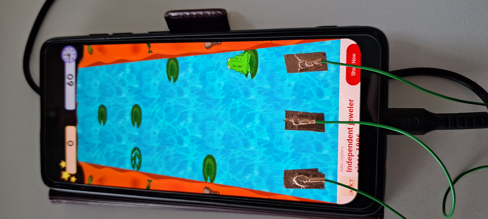
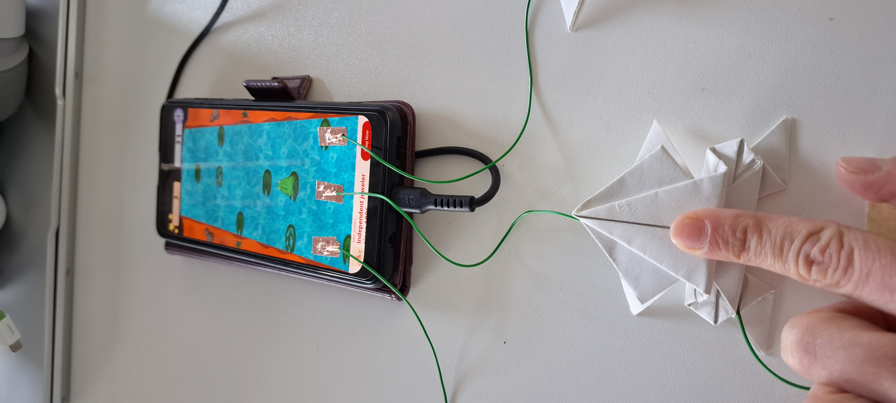
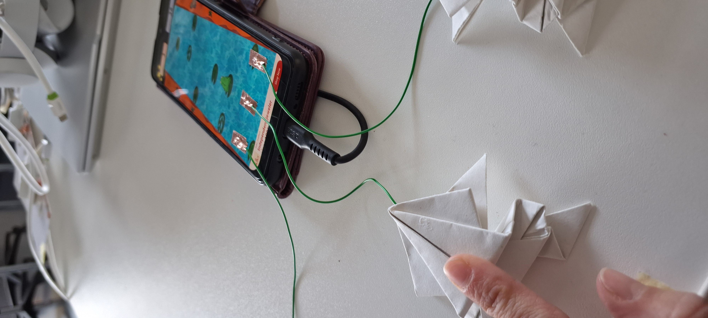
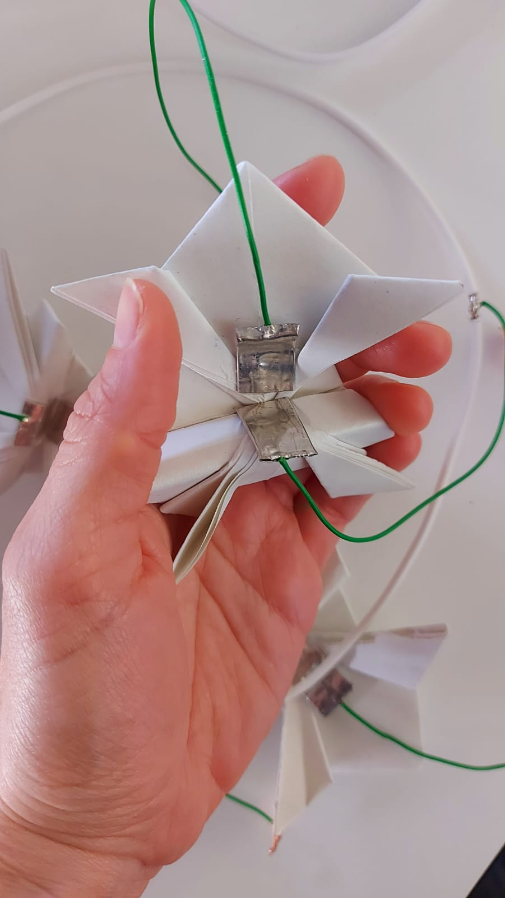

<video controls src="IMG_ref/Frog2.8.mp4" title="Title"></video>

# Arduino + Unity

Connecting arduino to unity in order to use tactile inputs to guide the player in a game.
The idea is to test arduino components individually to understand the reactions and what kind of information is perceived by users to each stimulus.

## Led on/off
This first test was to make a led turn on and off being controlled by unity buttons. The main difficulty was to make the same port connect with arduino and Unity at the same time and exchange information through it.

Working test:
1. Arduino IDE open with serial monitor closed
2. Arduino connected to port COM8
3. Unity play in Game mode (linking script arduino+Unity applied to cube. Button with logic on click() logic with cube applied and script public void 'turnOn'/'turnOff called to each button)

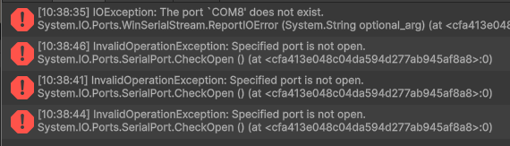

- LedOn Unity C#: [code](REFs/LedOnOff2.cs)
- LedOn arduino IDE: [code](REFs/UnityLed.ino)

## Vibration Motor on/off
The second test was to make a mini vibration motor 2mm to turn on and off being controlled by the same unity buttons, to understand if the same logic of the led can be easly replicated for other components. The motor was simply wired with a 150ohm resistor and worked easly with a few adaptations to the arduino and unity script.

- Vibration motor Unity c#: [code](REFs/VibrationMotor.cs)
- Vibration motor arduino IDE: [code](REFs/VibrationMotor.ino)

# Spatial Lights location
The objective of this third prototype is to test the spatial logic communication for future devellopment on the final project.
A virtual NPC walk around a virtual space. The NPC general location is displayed physically by the activation of 8 different lights, which work as a compass, displaying the general direction of the NPC based on a fixed central origin (players location).

## Version 1: 2D
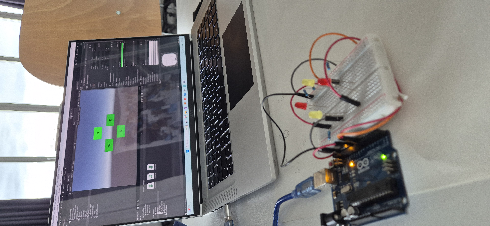
<video controls src="IMG_ref/20260220_130000.mp4" title="Title"></video>

## Version 2: 3D
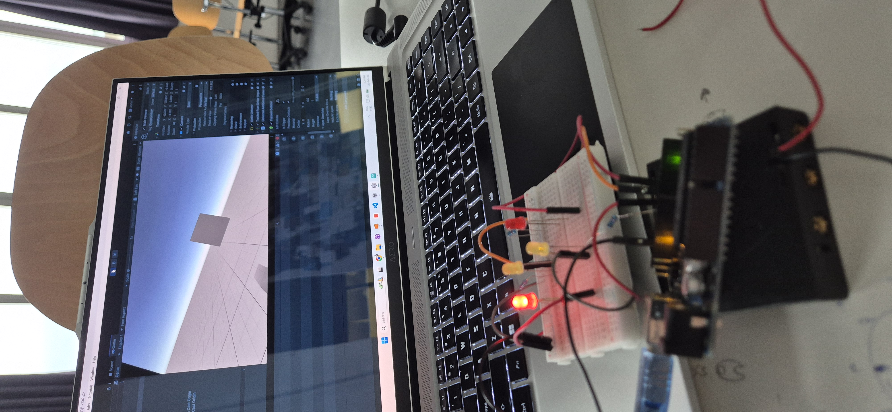
<video controls src="IMG_ref/20260220_171711.mp4" title="Title"></video>

Jury Day:

