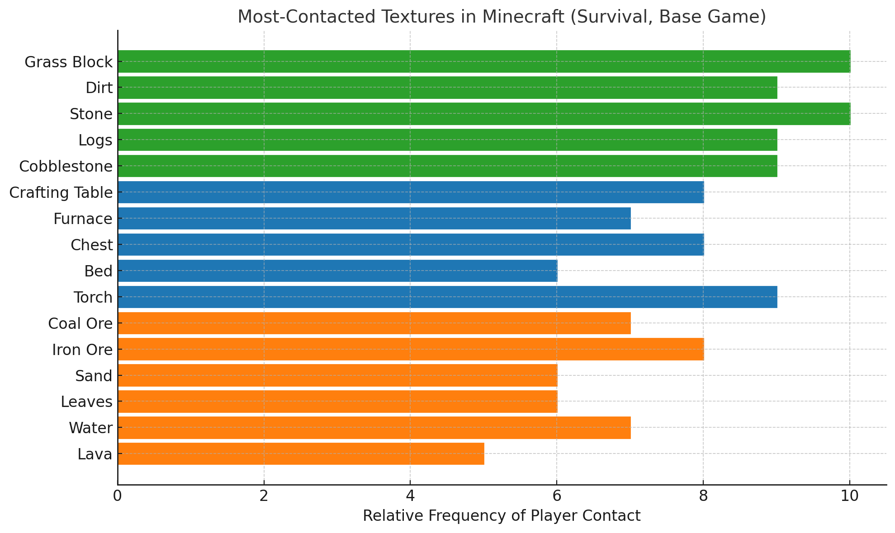

# TEXTURES

*(Fonte: https://minecraft.fandom.com/wiki/Textures)*

Textures in Minecraft are images applied to blocks, items, entities, particles and GUI that allow players to recognize it. 

## Texture list
### Blocks
The textures of the blocks in Minecraft are usually done in 16 x 16 pixels. Some blocks have an animated texture like water, lava, portal blocks, fire, prismarine, sea lantern, sea grasses, command block and magma blocks as well as stonecutter which have an animated pattern on each side. The animated textures are presented with a series of 16 x 16, the play of which will alternate in succession.

### Items
Just like the blocks, usually the textures of the items in Minecraft are also done in 16 x 16 pixels. Most of the item textures are static, except those for clock and compass. In Java Edition, these animated textures are many separated 16 × 16 images, while in Bedrock Edition and Minecraft Education they are presented with a series of 16 x 16.

Light block and the elements in Bedrock Edition and Minecraft Education are the only item textures done in 32 × 32 for officially released Minecraft versions.

### Entities
Similar to the skin images, the textures of entities usually integrate images applied to all parts of an entity into one single file. Their resolution are higher than 16 x 16 pixels, but typically their heights and widths are multiples of 16px.

### Particles
Special graphical effects in Minecraft that are created when certain events occur, such as destroying items, explosions, rainfall, or smelting items in a furnace.

Particles are rendered as front-facing 2D sprites, meaning they always face the player. They disappear after a short animation, in which they may change sizes and rotate, and cycle between a number of animation sprites. They collide with solid blocks and are slowed by cobwebs, but are unaffected by other entities.

- In Bedrock Edition and Minecraft Education they are in data\vanilla and data\vanilla_<game version>

    #### **Weather effects**
    **Rain**
    - Rain particles make noise when they hit a block, and this noise can be heard at any point within 16 blocks. Plays two different sound files.
    
    **Snow**
    - Snow does not cover transparent blocks.
    - Leaves in snowy taigas appear frost covered when snowfall happens.
   
    **Lightning**
    - Creates fires where it strikes. 
    - Turns creepers into charged creepers (green > blue, transparent electric texture + blue particles), villagers into witches, pigs into zombified piglins, and mooshrooms into their brown variants. 
    - Thunder is a sound that occurs every time lightning strikes. It can be heard by the player up to 160,000 blocks away from the position of the lightning strike.
    
    **Thunderstorm**
    - reduce Render brightness (sky+clouds+ground) decreases during thunderstorms.

### GUI: Inventory
Pop-up menu used by the player to manage items they carry: equip armor, craft items (2×2 grid), equip tools, blocks, and items. - The player's skin is also displayed here.

- External inventories - Many blocks and some non-player entities have their own inventory-like windows that pop up to allow manipulation of items 

- The available slots for setting attributes are "mainhand", "offhand", "head", "chest", "legs", and "feet".

🟩 Ground / building materials (grass, dirt, stone, logs, cobblestone)

🟦 Functional objects (crafting table, furnace, chest, bed, torch)

🟧 Resources / environment (ores, sand, leaves, water, lava)

**Minecraft 1.21 (Java)**

The “Category: Entity textures” on the Minecraft Wiki includes hundreds of texture files. 
    https://minecraft.wiki/w/Category%3AEntity_textures?utm_source=chatgpt.com

The “Particle textures” (static + dynamic) category has 187 different texture files listed. 
    https://minecraft.wiki/w/Category%3AParticle_textures?utm_source=chatgpt.com

A community-maintained list claims that in Survival mode (i.e. excluding creative-only items), as of Minecraft 1.21.4 Java, there are 1,582 obtainable items and blocks. 
    https://www.reddit.com/r/Minecraft/comments/1i7zp3j/list_of_everything_in_minecraft_survival_1214/?tl=fil&utm_source=chatgpt.com

The Minecraft Wiki’s “Item” page states that as of 1.20, there are 1,643 items (excluding block items) in the game.
    https://minecraft.fandom.com/wiki/Item?utm_source=chatgpt.com

        OVERALL ESTIMATE
        - ~1,650-1,700 distinct blocks + items (including creative-only) as earlier estimate

        - Entity (animals / NPCs / mobs) textures — suppose there are ~300-400 different entity texture files (mobs, items worn, animations etc.)

        - Particle textures (~180-200) 

        ≈ 2,200 to 2,300 distinct texture files / distinct object/entity/particle textures in Minecraft 1.21 (Java)

Minecraft has ~2,200–2,300 distinct textures, only a fraction of them actually correspond to unique in-game behaviors or logics.

Textures in Minecraft can be grouped into two broad categories:

🧱 1. Purely decorative or material-variant textures

These make up the majority, around 70–80% of all textures.
They look different but behave identically — e.g. 16 colored terracotta blocks, 8 wood types, glazed terracotta variants, banners, carpets, etc.

→ Roughly 1,600–1,800 textures fall into this category.

⚙️ 2. Behavior-linked textures

These are textures associated with distinct logic, mechanics, or interactivity.
You can think of these as “classes of behavior.”

[text](<MineCraft Textures.csv>)